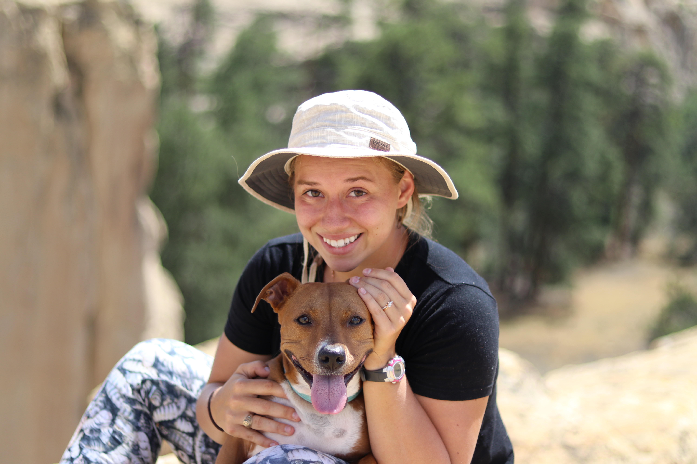

# **Introductions**

Hey y'all, how do you like my website?

# Project 0 Requirements

Under the introductions tab you will see my answers to all of the required elements as well as some photos. 

Under the links tab you will see two links.

To the right is a picture of Janet, my dog, and I during a hike in New Mexico at El Morro National Monument. Very pretty place. Also yes, my pant print is "grubs" or black soldier fly larvae to be precise. 

### Janet is the cutest pupper in the world

</a>

